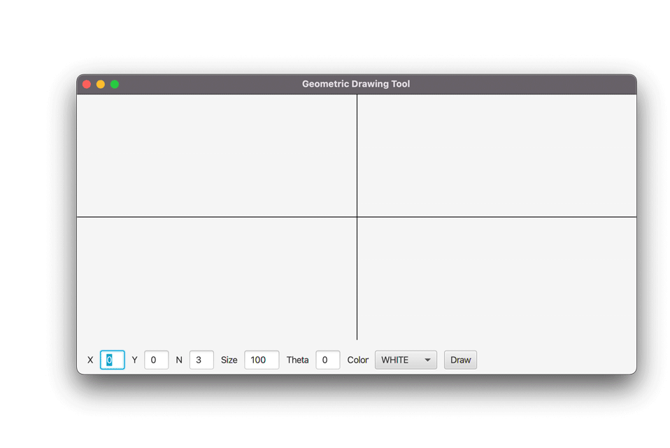

# OOP - WS 2022/23 - Exercise 10

## Object Oriented Programming - 2309 - Prof. Ronny Hartanto

 

---   
 
### Maximum number of "**commit/push**" for this exercise is **5**
 
> If you commit/push into the repository more than 5 times, you will not get any points for this exercise. 
> Initially, github will create your repository by filling it up with necessary contents. Therefore, you will start with x commits. The commit/push limitation is counted toward your commits, thus you should not exceed the x + 5 commits in total to receive the points for this exercise. 

--- 

## Assignments

 

* **WS2023/24** The points are not part of the final assessment. This purely exercise to help you learn Java programming.
  
Create a Graphical User Interface (GUI) using JavaFX for drawing a regular polygon as previously defined in the **RegularPolygon** class in the past exercise. The GUI must have the following features: (Total 21 points)
1. It draws cartesian axes with the center as its origin (0,0).
2. The axes will be updated accordingly by maintaining the position of the origin in the center of the GUI upon resizing the windows size (5 points).
3. The user shall be able to enter the origin (x,y), number of sides, size, angle (theta), and color properties of the polygon.
4. Pressing *Draw* button will update the displayed image on the GUI accordingly. The following criteria are used to awards the points for this assigment.
    * Correct position (x,y) as entered in the GUI with different combination of n, angle and size will be awarded with 5 pts. 
    * Correct size and various n as entered in the GUI will be awarded with 5 pts.
    * Correct angle representation as entered in the GUI will be awarded with 3 pts. The GUI only accept theta in degrees. 
    * Correct color fill as entered in the GUI will be awarded with 3 pts. The GUI must provide at least 5 different colors to choose. 

* *Only running application will get points. No partial points on non-running program (not compiled).*
* This exercise is not graded automatically, thus make sure your submission contains all necessary files to run the application. Any missing file which causes the application not working on the test machine will lead into failed submission and no points awarded. (You don't need to include any JavaFX libraries in your submission. The JavaFX library already installed in the test computer for testing your submission.)
* No further discussion regarding the points mentioned above, you should know and aware what files are required to run your application. 

---

## Instruction
You have to work on your local machine to do this exercise. Don't use the WebIDE as it will use up your "commit/push" tokens. 

**Please follow the following steps:**
1. Clone the repository into your local computer. (you can use terminal or any Git client)
2. Open the local repository on your local computer using your favourite editor (text editor or IDE)
3. Work on your assigment solve all the given problem, make sure they run on your computer. **Don't change the structure of the directory**
4. If you completed all the assigments, *commit* your change to Git and *push* it to the Github (using your GitClient or terminal)
5. Check your submission by visiting your Github repository, after a while you should be able to see the result (:white_check_mark: or :x:)
6. If you have :white_check_mark: then you are done with your exercise, otherwise repeat step 3 onward. 

--- 

## Important

You can ONLY change files inside the **src/main/java** folder and place your name in this readme file. Depending on your task, you might need to create a new class in the **src/main/java** folder. Please don't make any modification anywhere else. 

**Make sure you submit your exercise before the deadline.** 
> If you submit after the deadline, it will not be graded

---
## Notes
* **WS2023/24** The points are not part of the final assessment. This purely exercise to help you learn Java programming.
* The submission will be evaluated automatically (most of the case)!
    * If it doesn't compile, it could be some mistakes on your submission. (no points will be awarded in this case)
* You will receive the points upon successful solving the tasks. 
* You can make or modify your submission before the deadline
* Make sure you don't exceed the limit, sometime it's better to get partial points than exceeding the limit. 
* Use this exercise to practice your programming skill
